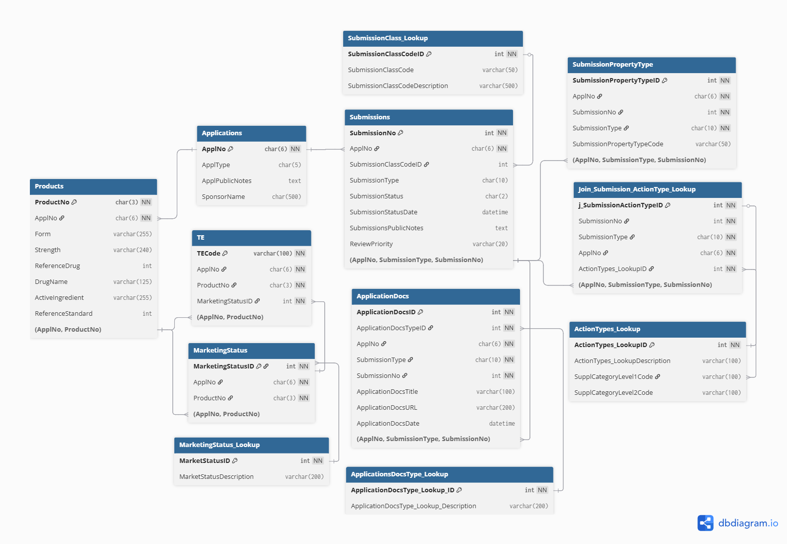

<h1 align="center">
  
  <br>
</h1> 

# Clinical Trials: Exploring Patterns in Global Drug Development

## Table of Contents
- [1. Business Issue](#1-business-issue)
- [2. Business Use Case](#2-business-use-case)
- [3. Data Sources and Licensing](#3-data-sources-and-licensing)
- [4. Data Preparation and Cleaning](#4-data-preparation-and-cleaning)
- [5. Project Structure](#5-project-structure)
- [6. Methodology](#6-methodology)
- [7. Results and Insights](#7-results-and-insights)
- [8. Future Work](#6-future-work)
---

## 1. Business Issue
Clinical Trials and FDA Approvals are critical components of the drug development process, a high-cost, high-risk pipeline that produces massive, complex datasets scattered across multiple regulatory and research sources. Most clinical trials fail to deliver an approved therapy, and understanding how trial characteristics align with approval outcomes can reveal inefficiencies or opportunities to make drug development faster, cheaper, and more effective.

Originally, this project aimed to identify drivers of successful FDA approval by directly linking ClinicalTrials.gov studies to Drugs@FDA submissions. However, because the FDA datasets do not contain unique identifiers consistently mapping specific clinical trials to specific drug approval events, this project no longer attempts to definitively link trials to approvals, instead focusing now on patterns, correlations, and contextual insights observable across the ClinicalTrials.gov dataset.

### Areas of Interest

- **Therapeutic Areas:** Which disease areas (oncology, cardiology, neurology, etc) show the most activity or historically high approval volume?
- **Trial Scale and Design:** How do participant counts, trial duration, and number of study sites vary across conditions and sponsors?
- **Sponsors:** How does sponsorship type (industry, government, academic) influence late-phase activity or result reporting?
- **Time to Market:** What are typical timelines from trial start to primary completion, and how do they compare with approval patterns at a broader level?
- **Geographic and Economic Context:** How does trial activity vary across countries, and how does this relate to economic or healthcare-spending indicators? 
- **Development Pipeline:** How frequently do trials progress to later phases, and how have these trends changed over time, or over various disease areas? 

This project aims to provide a data-driven perspective on how and where drug development efforts are focused.

---

## 2. Business Use Case
This analysis can help:
- R&D teams identify therapeutic areas with substantial late-phase activity or rapid development cycles.
- Regulatory and research organizations understand how trial activity and approval outcomes vary across diseases, sponsors, and countries.
- Clinical development teams evaluate which trial characteristics are most common in successful development programs. 

Rather than pinpointing the exact conditions that cause approvals, the project surfaces associations and trends, using FDA data as contextual background rather than a directly linked endpoint. The FDA data provides valuable context on approval activity, but because it lacks consistent trial-level identifiers, the project uses approval records as a parallel analytical dimension, not a directly linked endpoint.

---

## 3. Data Sources and Licensing

This analysis uses data from **ClinicalTrials.gov**, **FDA Drugs@FDA**, and **World Bank Health Expenditure** datasets.  
All sources are publicly available and may be reused for research and educational purposes with proper attribution.

---

### **ClinicalTrials.gov**

- **Access Method:** [ClinicalTrials.gov Search Tool](https://clinicaltrials.gov/search) ([Search Guide](https://clinicaltrials.gov/find-studies/how-to-search))  
- **Description:** Public registry of clinical trials maintained by the U.S. National Library of Medicine.  
- **Full Archive (optional):** [AllPublicXML.zip](https://clinicaltrials.gov/AllPublicXML.zip)  
- **Relevant Fields Used:** `NCTId`, `BriefTitle`, `HasResults`, `Condition`, `InterventionName`, `Phase`, `OverallStatus`, `SponsorName`, `StartDate`, `CompletionDate`, `LocationCountry`  
- **Purpose:** Provide trial-level metadata such as phase, sponsor, status and location to analyze relationships with regulatory outcomes.  
- **Licensing:** Data are in the public domain (17 U.S.C. § 105) and may be freely used. See [Terms & Conditions](https://clinicaltrials.gov/about/terms-conditions).
- **Supprting Information:** [Data Element Definitions for Interventional Studies](https://clinicaltrials.gov/policy/protocol-definitions). This link contains supporting information for the data provided in the ClinicalTrials.gov dataset. These definitions are discussed further in section 4.
---

### **FDA Drugs@FDA Database**

- **Access Method:** [FDA.gov Drugs@FDA Data Files](https://www.fda.gov/drugs/drug-approvals-and-databases/drugsfda-data-files)  
- **Description:** 12-table relational dataset from the FDA detailing brand and generic prescription and biological therapeutics, including submission and approval data.  
- **Tables Referenced:** `Products`, `Applications`, `Submissions`, `MarketingStatus_Lookup`, `SubmissionClass_Lookup`, `ApplicationDocs`, `ActionTypes_Lookup`  
- **Relevant Fields Used:** `application_number`, `active_ingredient`, `drug_name`, `sponsor_name`, `submission_status`, `submission_status_date`  
- **Purpose:** Link approved drug records to their originating clinical trials to identify which studies advanced to successful approval.  
- **Licensing:** Data are public domain and may be reused with attribution. See [openFDA License](https://open.fda.gov/license/) and [Website Policies](https://www.fda.gov/about-fda/about-website/website-policies).

---

### **World Bank Health Expenditure Data**

- **Access Method:**  
  [World Bank Health Expenditure CSV](https://data.worldbank.org/indicator/SH.XPD.CHEX.PC.CD)  
  [World Bank API (downloadable CSV)](https://api.worldbank.org/v2/en/indicator/SH.XPD.CHEX.PC.CD?downloadformat=csv)  
- **Description:** Country-level health expenditure per capita (current USD). Used to normalize clinical trial and approval activity by national health spending.  
- **Relevant Fields Used:** `NCT Number`, `Study Title`, `Study URL`, `Study Status`, `Conditions`, `Interventions`, `Sponsor`, `Collaborators`, `Phases`, `Enrollment`, `Funder Type`, `Study Type`, `Start Date`, `Primary Completion Date`, `Completion Date`, `Locations` 
- **Purpose:** Provide contextual economic data to explore variation in trial and approval outcomes across countries.  
- **Licensing:** Data provided by the World Bank Open Data portal under the [Creative Commons Attribution 4.0 International (CC BY 4.0)](https://creativecommons.org/licenses/by/4.0/) license. Attribution: *World Bank, Health Expenditure per Capita (2025)*.  
- **Optional Extensions:** Future enhancements may incorporate **PharmaPendium** or **DrugBank** data to improve linkage between drug approvals and clinical trials.

---

## 4. Data Preparation and Cleaning
### **ClinicalTrials.gov Data**
A large portion of this analysis is based on the Interventions and Conditions columns. Detailed definitions ot these two categories can be found on the ClinicalTrials.gov website, and are as follows:

- **Interventions**:  A brief descriptive name used to refer to the intervention(s) studied in each arm of the clinical study. A non-proprietary name of the intervention must be used, if available. If a non-propriety name is not available, a brief descriptive name or identifier must be used. Limit: 200 characters.  Intervention types contained in the clinicaltrial dataframe include the following:

- Drug: Including placebo
- Device: Including sham
- Biological/Vaccine
- Procedure/Surgery
- Radiation 
- Behavioral: For example, psychotherapy, lifestyle counseling
- Genetic: Including gene transfer, stem cell, and recombinant DNA
- Dietary Supplement: For example, vitamins, minerals
- Combination Product: Combining a drug and device, a biological product and device, a drug and biological product; or a drug, biological product, and device
- Diagnostic Test: For example, imaging, in vitro
- Other

- **Conditions**: The primary disease or condition being studied in the trial. The name(s) of the disease(s) or condition(s) studied in the clinical study, or the focus of the clinical study. If available,trials used appropriate descriptors from NLM's Medical Subject Headings (MeSH)-controlled vocabulary thesaurus or terms from another vocabulary, such as the Systematized Nomenclature of Medicine—Clinical Terms (SNOMED CT), that has been mapped to MeSH within the Unified Medical Language System (UMLS) Metathesaurus. 

### **FDA Data**
The FDA Drugs@FDA dataset is organized into twelve relational tables with a defined entity-relationship structure. A full Entity Relationship Diagram (ERD) based on the FDA's published schema can be viewed here:

[View the full FDA Entity Relationship Diagram](docs/FDA-ERD.png)



This diagram illustrates the nature of the relationshps between the various tables, including:
- **Applications** (drug-level metadata)
- **Products** (individual drug products)
- **Submissions** (regulatory filings and their status)
- **ApplicationDocs** (review documents tied to submissions)
- **MarketingStatus** and **TE Codes** (market availability and equivalence)
- Lookup tables for **submission class**, **document type**, and **action type**


## 5. Project Structure
```bash
data/           # raw and cleaned datasets
notebooks/      # Jupyter notebooks for analysis and visualization
scripts/        # Python scripts for EDA and modeling
visuals/        # static figures and charts
docs/           # documentation and assets (README, banner image)
```

## 6. Methodology
- Exploratory Data Analysis (EDA)
- Time-series trends, sponsor categories, disease areas
- Descriptive statistics and contextual visualizations

Note: No statistical models are used to infer causality or predict approval outcomes due to data linkage limitations.


## 7. Results and Insights
Insights from this analysis will be obtained through the exploratory data analysis phase, with a focus on uncovering patterns and trends across therapeutic areas, trial scale, sponsor class, geographic activity, and overall study timelines. The questions below outline the major directions this project may pursue:

### Therapeutic Areas & Disease Landscape
- Are certain disease areas (oncology, cardiology, infectious diseases, etc.) associated with more clinical trial activity or historically higher approval volume?
- Which diseases or therapeutic classes drive the most late-phase (Phase 3) research?
- How has trial activity (especially Phase 3) changed over time across major disease areas?

### Trial Scale, Duration, and Design
- Are there patterns related to number of participants, number of locations, trial duration, or number of study sites?
- Do larger or longer studies cluster within particular disease areas or sponsor types?
- How do trial characteristics vary across trial phases (1, 2, 3, 4)?

### Pipeline Progression & Phase Dynamics
- What percentage of trials reach Phase 2 or Phase 3?
- How often do late-phase trials progress toward completion or results reporting?
- Which therapeutic areas show the strongest or weakest late-phase progression rates?

### Sponsors
- Are there differences in activity or outcomes between industry trials vs. academic or government-sponsored trials?
- Which sponsors or sponsor types contribute the most to high-volume research categories?
- Do sponsor categories differ in trial duration, enrollment size, or multi-site activity?

### Geographic Activity & Global Context
- Which countries are most involved in clinical research, and how does this compare to national health-expenditure levels?
- Are there countries with significantly above- or below-average trial involvement relative to economic standing?
- Which regions show strong growth in trial activity over time?

### Approval Context (High-Level, Not Trial-Linked)
Because trial-level identifiers cannot be reliably matched to individual FDA approvals, approval data is used as a **contextual backdrop** rather than a direct endpoint.
- Which therapeutic areas historically receive the most FDA approvals?
- How do approval trends compare with areas that show high clinical trial activity?
- Which areas exhibit longer development timelines or lower approval frequency when viewed at a macro level?

These guiding questions shape the structure of the EDA and the insights the project aims to uncover.


## 8. Future Work
